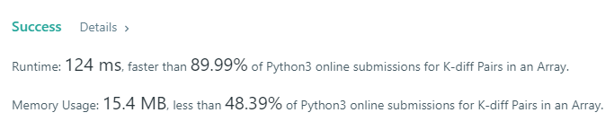
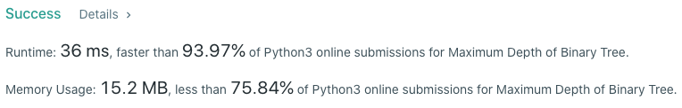

# Collection of Algorithmic Solutions written in Python3

## Structure
- At the top of each file, the problem's prompt, example outputs, and constraints/restrictions will be posted as a comment.
- Following the constraints, solution is written below.
- Time complexity will be included in the commit message.
- (Edit) Some of the algorithms are organized into Jupyter Notebooks as there were periods of time that I did not have access to a text editor.

## Purpose
- To gain further proficiency with algos and data structures.
- To gain further proficiency with time & space complexity optimization.

## Notable Implementations
- reverse_int.py:  
 Faster than 60% of all other Python3 submissions. Achieved this by using a HashTable to store the individual digits as index:digit  pairs. By taking advantage of the HashTable's constant lookup time I managed to keep the runtime pretty low although space complexity took a small hit.

- k_diff_pairs.py:  
 Faster than 90% of all other Python3 submissions. Classic case of where hash maps can be used to maximize time complexity. Average time is linear.

  

- maxdepth_bintree.py:  
 Faster than 94% of all other Python3 submissions. Demonstrating recursive traversal of binary trees and use of Python's ternary operator.

  
  
- n_unique_sumzero.py:  
 Optimized this one for space complexity to demonstrate that I can optimize both space & time. Uses 75% less space than all other submissions.

  

## Hurdles
- count_primes.py:  
 Double Counting: The current implementation uses nested for loops to iterate through the array of primes and subtracts 1 from the `num_primes` if it comes across one where `array[numerator] % array[denominator] == 0`. However, this results in a miscount where if n is 143, it'll substract one for when numerator = 11 and also for numerator = 13.

  Solution: Set the value of the number that contains both factors as negative the first time it's being counted for. Then with the inclusion of a conditional that checks `array_primes[n_index] > 0` will cause the loop to skip over the value.   

- k_diff_pairs.py:  
 Logic: Initially had some logic issues with how to implement the method (for implementations faster than O(nlogn)). I was trying to do checks on `abs(value - k)` as opposed to splitting the absolute value into two equations.

  Solution: Because `|a - b| = k` can be split into `(a - b) = k` and `(a - b) = -k`, if we treat these as two separate conditionals we don't get any issues when we change the `hash_map[value]` to False.

